# SK62
A 60% split mechanical keyboard with 62 keys, powered by KMK firmware and based on the Raspberry Pi Pico.

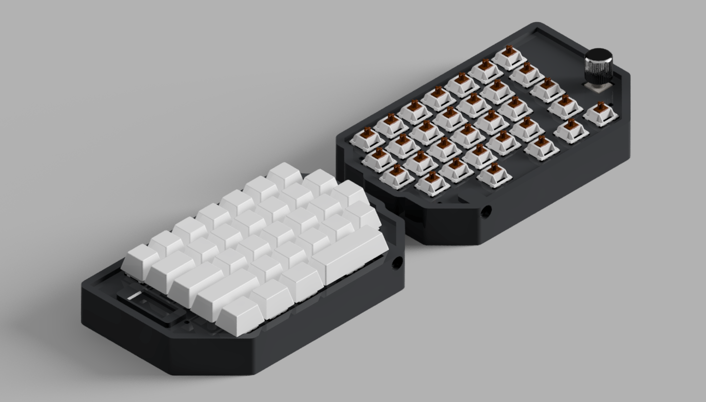

## Features

- Custom firmware KMK
- 62 keys
- Split design
- Rotary encoder

## Firmware

The keyboard uses KMK Firmware allowing for easily customizations in Python.

## Schematic
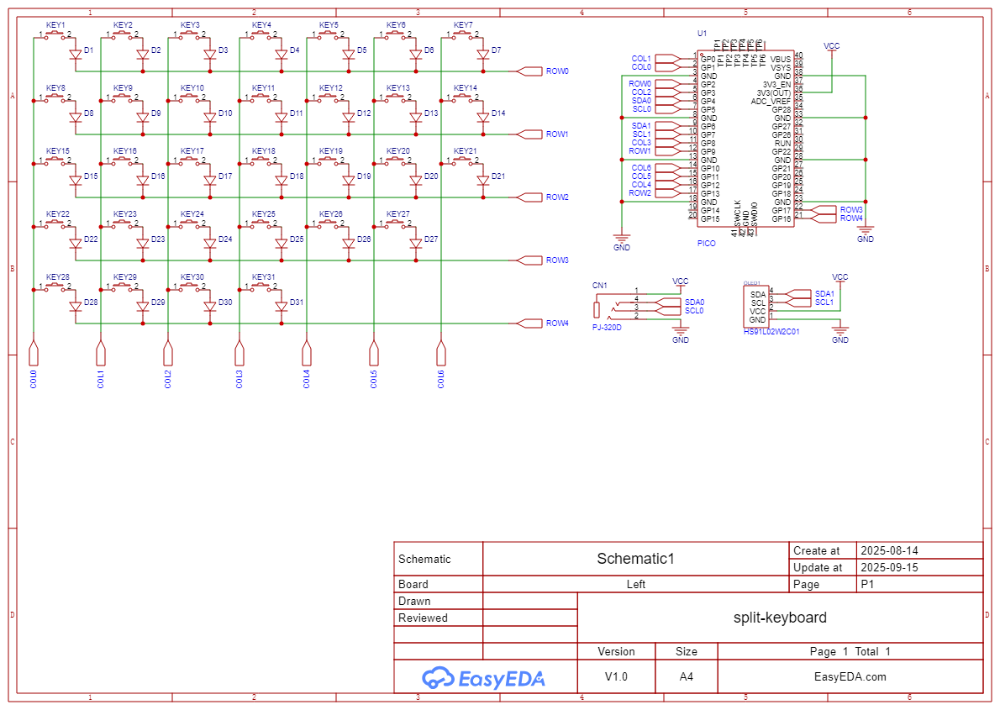

## PCB
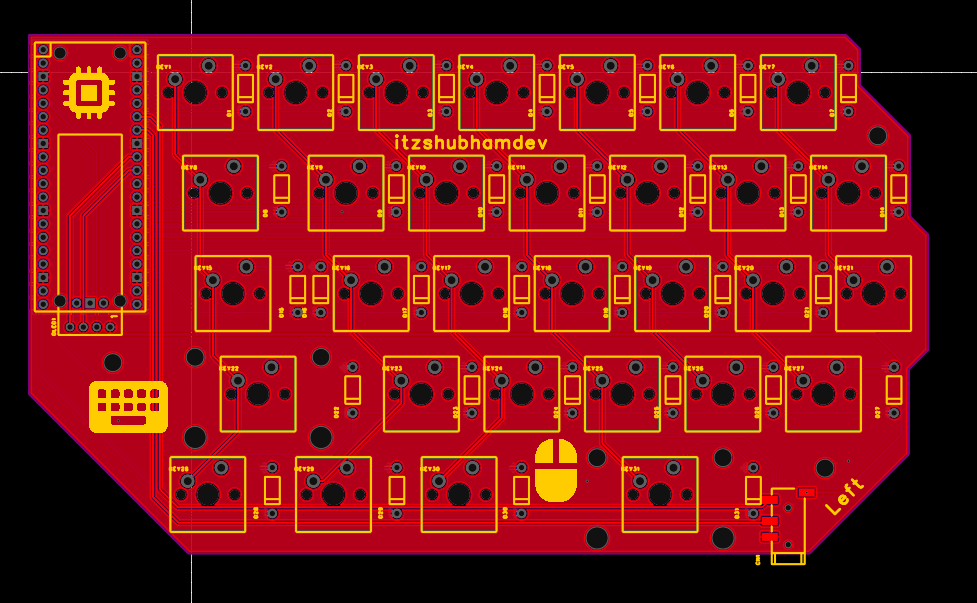

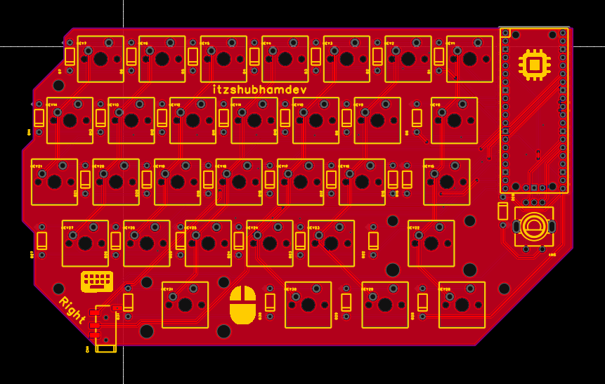
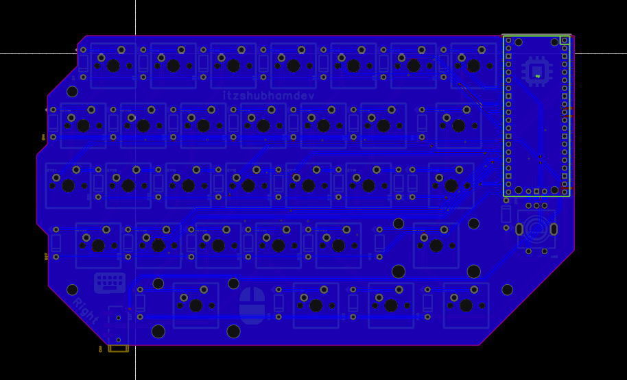

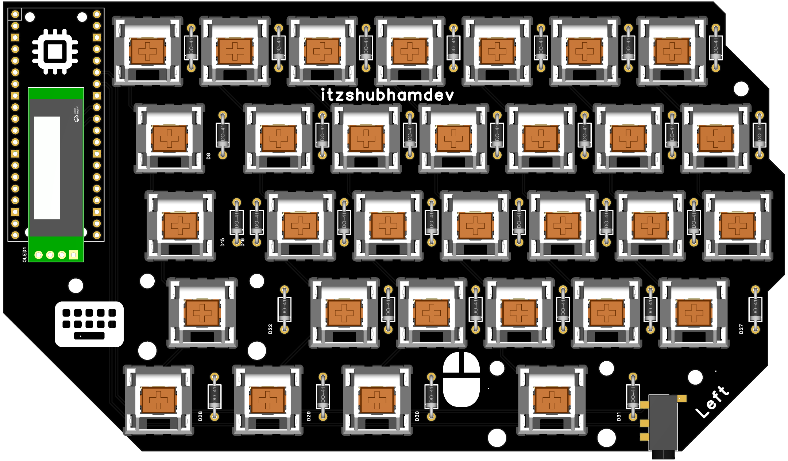
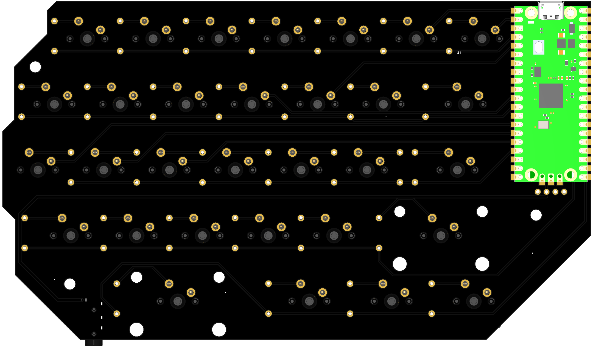
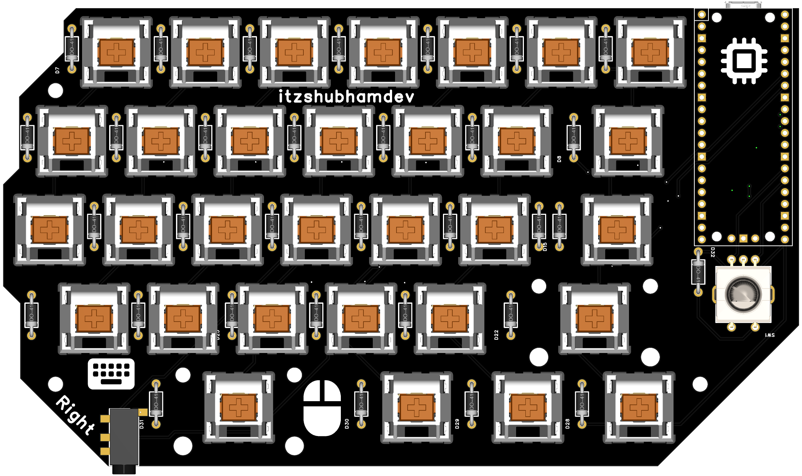
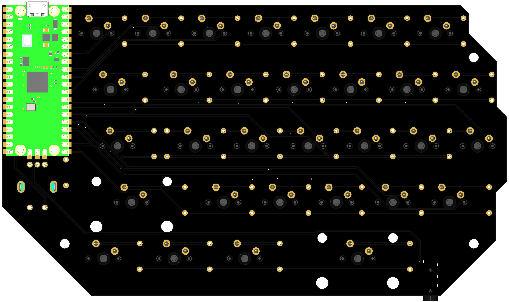

## Case

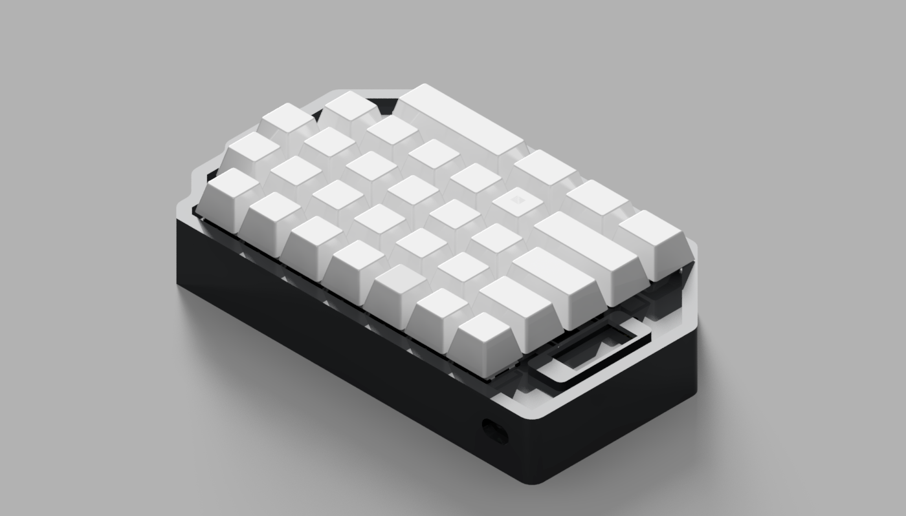
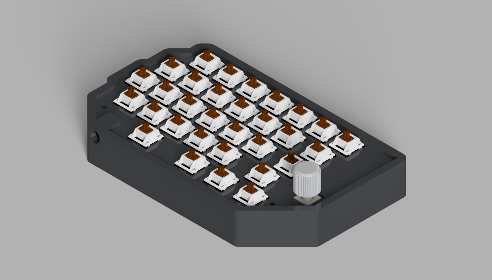
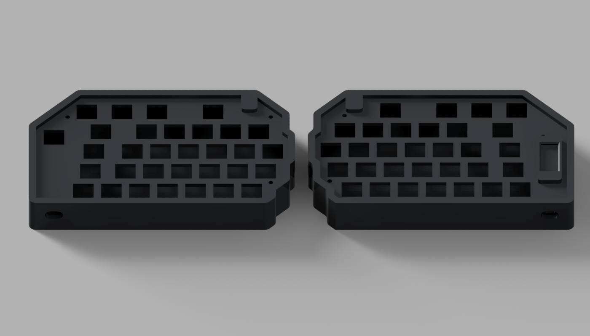
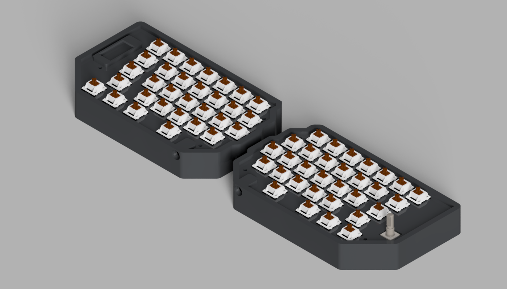